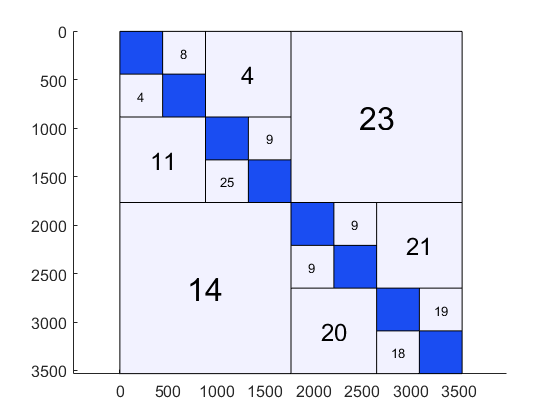
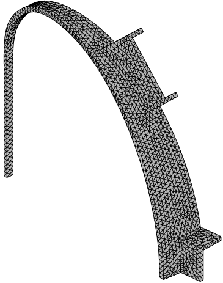

  
# Dense Matrix Market ([Authors contact](docs/contacts.md)) 

The purpose of this repository is twofold:

1. [Provide sample Matlab Integral Equation codes for a variety of electromagnetic problems and geometric elements](docs/sample.md)
2. [Provide means of generating benchmark dense matrices for exploring low rank approximation techniques](docs/dense.md)

# Citation
If you use this software suite, please consider citing:
* [R. Torchio, "A Volume PEEC Formulation Based on the Cell Method for Electromagnetic Problems from Low to High Frequency," in IEEE Transactions on Antennas and Propagation. doi: 10.1109/TAP.2019.2927789](http://ieeexplore.ieee.org/stamp/stamp.jsp?tp=&arnumber=8764572&isnumber=4907023)
* [D. Voltolina, P. Bettini, P. Alotto, F. Moro and R. Torchio, "High-Performance PEEC Analysis of Electromagnetic Scatterers," in IEEE Transactions on Magnetics. doi: 10.1109/TMAG.2019.2894618](http://ieeexplore.ieee.org/stamp/stamp.jsp?tp=&arnumber=8638854&isnumber=8716604)
